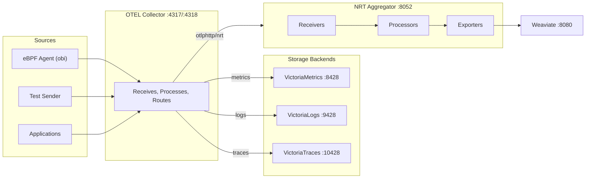
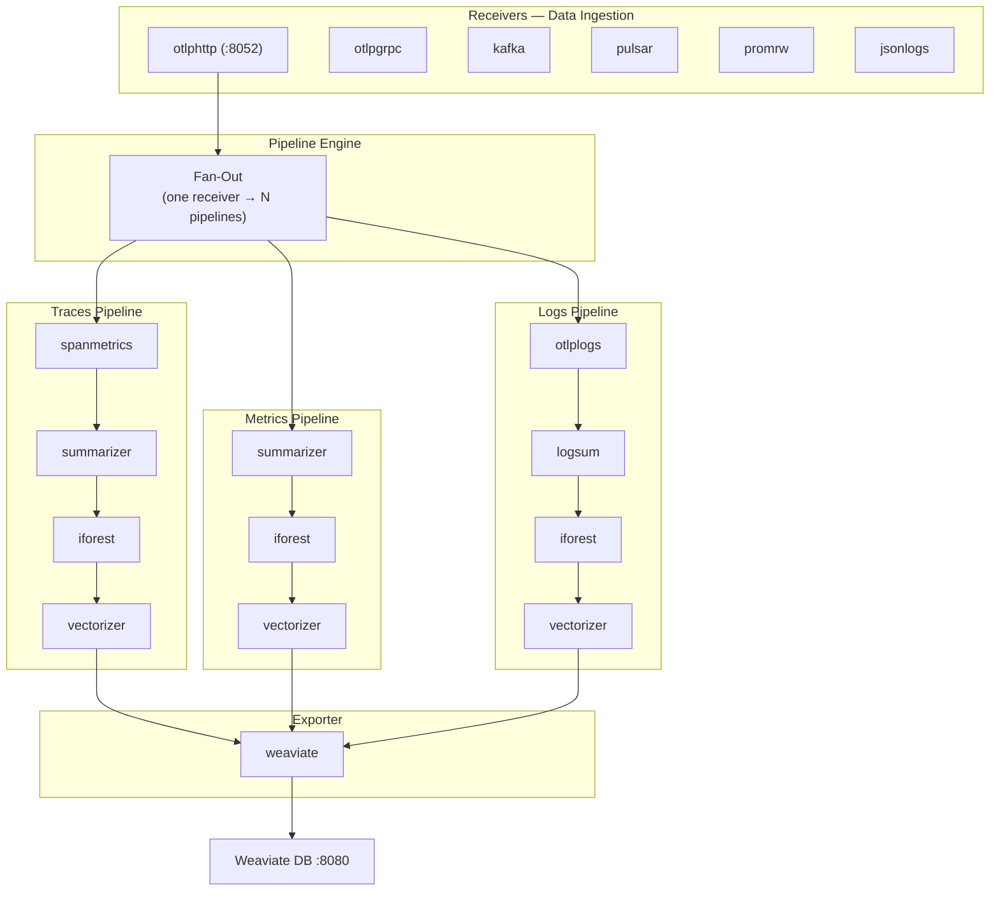
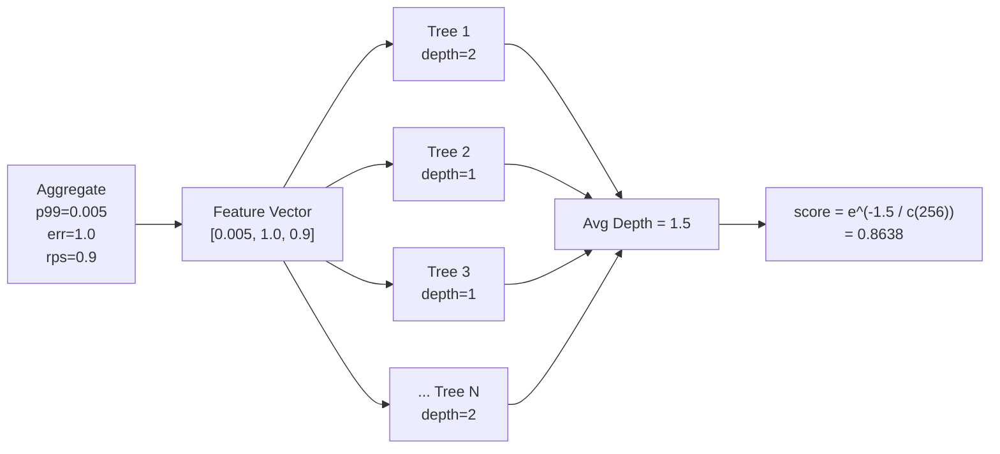

# EWS-Sense Platform — Complete Architecture

## High-Level Overview



---

## Data Flow — Step by Step

### Phase 1: Data Ingestion

```
Source (eBPF / App / Test Sender)
    │
    │  OTLP HTTP/gRPC
    ▼
OTEL Collector (:4317 gRPC / :4318 HTTP)
    │
    ├──► VictoriaMetrics (:8428)    — raw metrics storage (VMUI dashboards)
    ├──► VictoriaLogs (:9428)       — raw log storage (VMUI log search)
    ├──► VictoriaTraces (:10428)    — raw trace storage
    │
    └──► NRT Aggregator (:8052)     — AI-enriched aggregation
              │
              ├── Traces Pipeline:   spanmetrics → summarizer → iforest → vectorizer → weaviate
              ├── Metrics Pipeline:  summarizer → iforest → vectorizer → weaviate
              └── Logs Pipeline:     otlplogs → logsum → iforest → vectorizer → weaviate
                                                                                    │
                                                                                    ▼
                                                                            Weaviate (:8080)
                                                                      (vector search + anomaly data)
```

---

## NRT Aggregator — Internal Architecture

### Component Overview



### Receiver Sharing

Multiple pipelines can subscribe to the same receiver. Data is **deep-copied** and **fanned out** to each pipeline to avoid data races:

```
otlphttp receiver (:8052)
    │
    │ Envelope{Kind:"traces", Bytes: [...]}
    │
    ├──► copy → Traces Pipeline channel
    ├──► copy → Metrics Pipeline channel
    └──► copy → Logs Pipeline channel
```

Each pipeline gets its own processor and exporter instances to prevent concurrent state issues.

---

## Data Model

### Envelope (raw input)

Every receiver emits an `Envelope` — a generic container for any signal type:

| Field | Type | Description |
|-------|------|-------------|
| `Kind` | string | `"metrics"`, `"traces"`, `"prom_rw"`, `"json_logs"` |
| `Bytes` | []byte | Raw protobuf or JSON payload |
| `Attrs` | map | Optional metadata (remote addr, auth) |
| `TSUnix` | int64 | Arrival timestamp (Unix seconds) |

### Aggregate (processed output)

Processors transform Envelopes into `Aggregate` records — the canonical format stored in Weaviate:

| Field | Type | Description |
|-------|------|-------------|
| `Service` | string | Service name (e.g., `payment-svc`) |
| `WindowStart` | int64 | Window start (Unix seconds) |
| `WindowEnd` | int64 | Window end (Unix seconds) |
| `Count` | uint64 | Number of samples in window |
| `RPS` | float64 | Requests per second |
| `ErrorRate` | float64 | Error fraction [0–1] |
| `P50/P95/P99` | float64 | Latency percentiles (seconds) |
| `AnomalyScore` | float64 | Isolation Forest score [0–1] |
| `SummaryText` | string | Human-readable summary |
| `Vector` | []float32 | Embedding for vector search |
| `Labels` | map | Extra facets (top-K fields, etc.) |

---

## Processors — What Each One Does

### Traces Pipeline

| # | Processor | Input | Output | What It Does |
|---|-----------|-------|--------|--------------|
| 1 | **spanmetrics** | OTLP Traces (protobuf) | OTLP Metrics (protobuf) | Converts spans → RED metrics. Extracts duration, status, dimensions. Builds `requests_total`, `errors_total`, and `duration_histogram` metrics from each span. |
| 2 | **summarizer** | OTLP Metrics (protobuf) | Aggregate | Aggregates metrics into **fixed time windows** (10s). Uses t-digest for latency percentiles (P50/P95/P99). Computes RPS and error rate per service. |
| 3 | **iforest** | Aggregate | Aggregate (+ anomaly_score) | Runs feature vector `[p99, error_rate, rps]` through an **Isolation Forest** model. Short path = anomaly. Score in [0,1]. |
| 4 | **vectorizer** | Aggregate | Aggregate (+ vector) | Generates embedding vector from aggregate data. Modes: `hash` (FNV-based n-gram hashing), `ollama` (LLM embedding), or `pca` (dimensionality reduction). |

### Metrics Pipeline

| # | Processor | Input | Output | What It Does |
|---|-----------|-------|--------|--------------|
| 1 | **summarizer** | OTLP Metrics (protobuf) | Aggregate | Same as traces pipeline — windows + t-digest + RPS/error counting. |
| 2 | **iforest** | Aggregate | Aggregate (+ anomaly_score) | Anomaly detection on `[p99, error_rate, rps]`. |
| 3 | **vectorizer** | Aggregate | Aggregate (+ vector) | Builds numeric feature vector from metrics (p50/p95/p99/rps/error_rate/count) with optional PCA projection. |

### Logs Pipeline

| # | Processor | Input | Output | What It Does |
|---|-----------|-------|--------|--------------|
| 1 | **otlplogs** | OTLP Logs (protobuf) | JSON logs (Envelope) | Flattens OTLP `LogRecord` protobuf → JSON objects. Extracts: timestamp, severity, body, trace/span IDs, resource/scope attributes. Maps `service.name` to top-level `service` field. |
| 2 | **logsum** | JSON logs | Aggregate | Aggregates JSON logs into per-service windows. Counts total/error events, tracks unique users, computes top-K field summaries, optional quantile on numeric fields. |
| 3 | **iforest** | Aggregate | Aggregate (+ anomaly_score) | Same Isolation Forest scoring. |
| 4 | **vectorizer** | Aggregate | Aggregate (+ vector) | Builds text from log summary (service, error rate, top messages, severity distribution) → hashing or LLM embedding. |

---

## Anomaly Detection (Isolation Forest)



**Scoring logic:** `score = e^(-avgDepth / c(n))`
- **Closer to 1.0** → more anomalous (isolated quickly, short path)
- **Closer to 0.5** → normal (deep path, hard to isolate)
- `c(n)` normalizes by expected BST path length for subsample size `n`

---

## Weaviate Export

The weaviate exporter writes each `Aggregate` as a Weaviate object:

```
Aggregate {                          Weaviate Object {
  Service: "payment-svc"        →      class: "MiradorAggregate"
  P99: 5.05                     →      properties.p99: 5.05
  ErrorRate: 0.04               →      properties.error_rate: 0.04
  AnomalyScore: 0.84            →      properties.anomaly_score: 0.84
  SummaryText: "summary ..."    →      properties.summary: "summary ..."
  Vector: [0.1, 0.3, ...]       →      vector: [0.1, 0.3, ...]
}                                    }
```

**ID generation:** `SHA1(service:window_start:summary_text)` → deterministic UUID per signal type.

---

## Infrastructure (Docker Compose)

| Container | Port | Role |
|-----------|------|------|
| `otel-collector` | 4317 (gRPC), 4318 (HTTP) | Central telemetry hub — receives, processes, routes |
| `victoriametrics` | 8428 | Time-series metrics storage + VMUI |
| `victorialogs` | 9428 | Log storage + VMUI search |
| `victoriatraces` | 10428 | Distributed trace storage |
| `weaviate` | 8080 | Vector database for AI-enriched aggregates |
| `mirador-core` | 8010 | Core API service |
| `obi` (eBPF) | — | Kernel-level network call interception → OTLP spans |

---

## Configuration Example

```yaml
# config-e2e-test.yaml
receivers:
  otlphttp:
    endpoint: ":8052"

processors:
  spanmetrics:                    # Traces → RED metrics
    dimensions: ["service.name","http.method","http.route"]
  summarizer:                     # Time-window aggregation (t-digest)
    window_seconds: 10
  otlplogs:                       # OTLP Log protobuf → JSON
    service_key: "service.name"
  logsum:                         # JSON logs → per-service window aggregates
    window_seconds: 10
    error_levels: ["error", "fatal"]
  iforest:                        # Anomaly detection
    features: ["p99","error_rate","rps"]
    threshold: 0.7
    model_path: "iforest-model.json"
  vectorizer:                     # Embedding generation
    mode: "hash"
    hash_dim: 384

exporters:
  weaviate:
    endpoint: "http://localhost:8080"
    class: "MiradorAggregate"

pipelines:
  traces:   [otlphttp → spanmetrics → summarizer → iforest → vectorizer → weaviate]
  metrics:  [otlphttp → summarizer → iforest → vectorizer → weaviate]
  logs:     [otlphttp → otlplogs → logsum → iforest → vectorizer → weaviate]
```
